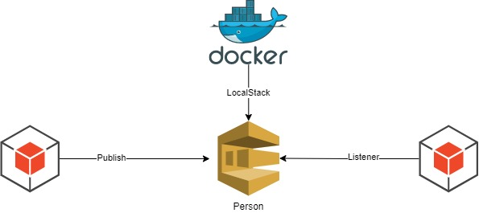

<div align="center">


</div>

<div align="center">

# POC - Localstack - AWS SQS com Springboot e Java
Trata-se de uma aplicação de prova de conceito para aplicar Api First utilizando Spring boot e Java e Swagger


</div>

<div align="center">

## Arquitetura


</div>

## Fundamentos teóricos

> LocalStack: O localstack instância (localmente) os principais serviços AWS, possibilitando assim a criação de um SandBox para desenvolvimento e aprendizagem. Ele utiliza a mesma interface de API dos recursos AWS. O desenvolvedor não tem nenhum prejuízo e a experiência no desenvolvimento e a mesma se tivesse interagindo com a AWS.

> Amazon Simple Queue Service: Amazon Simple Queue Service é um serviço de enfileiramento de mensagens distribuído introduzido pela Amazon.com no final de 2004. Ele suporta o envio programático de mensagens por aplicativos de serviço da Web como uma maneira de se comunicar pela Internet.

> Springboot: O Spring Boot é um projeto da Spring que veio para facilitar o processo de configuração e publicação de nossas aplicações. A intenção é ter o seu projeto rodando o mais rápido possível e sem complicação.

> Java: Java é uma linguagem de programação orientada a objetos desenvolvida na década de 90 por uma equipe de programadores chefiada por James Gosling, na empresa Sun Microsystems. Em 2008 o Java foi adquirido pela empresa Oracle Corporation.

## Tecnologias
- Java 11
- Spring Boot 2.5.0
  - spring-boot-starter-web
  - spring-boot-devtools
  - spring-cloud-starter-aws-messaging
  - spring-cloud-aws-messaging
- Tomcat (Embedded no Spring Boot)
- Git

## Execução

- Scripts
  ### Executar docker-compose
  - 1° comando: ``` cd src/main/docker/```
  - 2° comando: ```docker-compose -f docker-compose.yml up```
  ### Criando as filas no SQS
  - ``` aws --endpoint-url=http://localhost:4576 sqs create-queue --queue-name person```
  ### Listando as mensagens da fila no SQS
  - ``` aws --endpoint-url=http://localhost:4576 sqs receive-message --queue-url http://localhost:4576/queue/person --max-number-of-messages 10 ```  
  ### Executar a aplicação
  -  ```./mvnw clean compile spring-boot:run```
  ### Executar testes
  -  ```./mvnw clean compile verify sonar:sonar```

## Utilização
- Efetuar uma requisição REST com verbo POST na seguinte URL: localhost:8081/v1/events/persons/publish
- Payload
    ``` 
         {
            "name": "wesley",
            "age": 29,
            "cpf": "00000000000",
            "email": "wesleyosantos91@gmail.com"
         }
    
